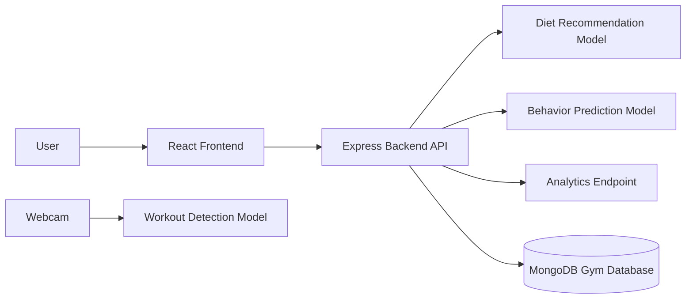

# AI Gym & Fitness Assistant Report

## Problem Statement

The AI Gym & Fitness Assistant is designed to help users manage workouts, diet plans, behavior patterns, and progress tracking from one system. The project combines a React frontend, Express backend, and Python-based AI modules to provide basic fitness recommendations and future support for workout detection using computer vision.

## Architecture Diagram



## AI Models Explanation

### Workout Detection

The workout detection module uses OpenCV and MediaPipe Pose to access the webcam and detect human pose landmarks. When pose landmarks are found, the script prints `Workout detected` and displays the webcam frame in an OpenCV window.

File: `ai-models/workout_detection.py`

### Diet Recommendation

The diet recommendation module accepts a user's weight and fitness goal. It returns a simple diet plan based on the goal:

- `muscle`: high protein diet
- `fat_loss`: low calorie diet
- default: balanced diet

Files:

- `ai-models/diet_recommendation.py`
- `ai-models/diet_model.py`

### Behavior Prediction

The behavior prediction module uses scikit-learn's `LogisticRegression` model with sample workout frequency and duration data. It predicts a behavior class based on workout days and minutes.

File: `ai-models/behavior_prediction.py`

### Gradio Demo

The Gradio demo provides a simple web interface that returns `Workout detected` for text input.

File: `ai-models/gradio_app.py`

## API Endpoints

| Method | Endpoint | Description |
| --- | --- | --- |
| GET | `/` | Returns backend health message: `AI Gym Assistant Running` |
| GET | `/diet` | Calls the Python diet model and returns a diet recommendation |
| GET | `/analytics` | Returns static analytics data for users, workouts, and active users |

## Screenshots

Screenshots can be added here after capturing the running application:

- Frontend dashboard at `http://127.0.0.1:5173`
- Backend root endpoint at `http://127.0.0.1:5000`
- Diet API response at `http://127.0.0.1:5000/diet`
- Analytics API response at `http://127.0.0.1:5000/analytics`
- OpenCV workout detection window
- Gradio app interface

## Testing Results

### Frontend Build

The React frontend was verified with:

```bash
npm run build
```

Result: build completed successfully.

### Backend Test

The backend was tested using Jest and Supertest:

```bash
npm test -- --runInBand
```

Result:

```text
Test Suites: 1 passed, 1 total
Tests: 1 passed, 1 total
```

### Python Model Checks

Python modules were checked by running the model scripts directly:

- `diet_recommendation.py` returned a high-protein diet for the muscle goal.
- `behavior_prediction.py` returned prediction output `[1]`.
- OpenCV, MediaPipe, NumPy, pandas, scikit-learn, and Gradio imports were verified.

## Final Checklist

| Requirement | Status | Notes |
| --- | --- | --- |
| Functional system | Complete | Local frontend, backend, and AI modules have been created. |
| AI modules working | Complete | Workout detection, diet recommendation, behavior prediction, and Gradio demo files are available. |
| APIs integrated | Complete | Express API includes `/`, `/diet`, and `/analytics`. |
| Frontend UI | Complete | React UI calls the diet API using Axios. |
| Admin dashboard | Partial | Static analytics API exists; a full dashboard UI can be expanded from this. |
| Deployment links | Pending | No live deployment URL has been created yet. |
| Documentation | Complete | Project overview and report files are included in `docs`. |
